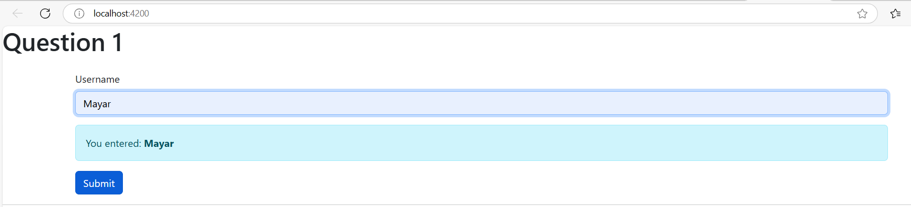

1. Add a Input field which updates a property ('username') via Two-Way-Binding
2. Output the user name property via string interpolation (in a paragraph below the input)
3. Add a button which may only be clicked if the user name is not an empty string
4. upon clicking the button, the username should be reset an empty string

