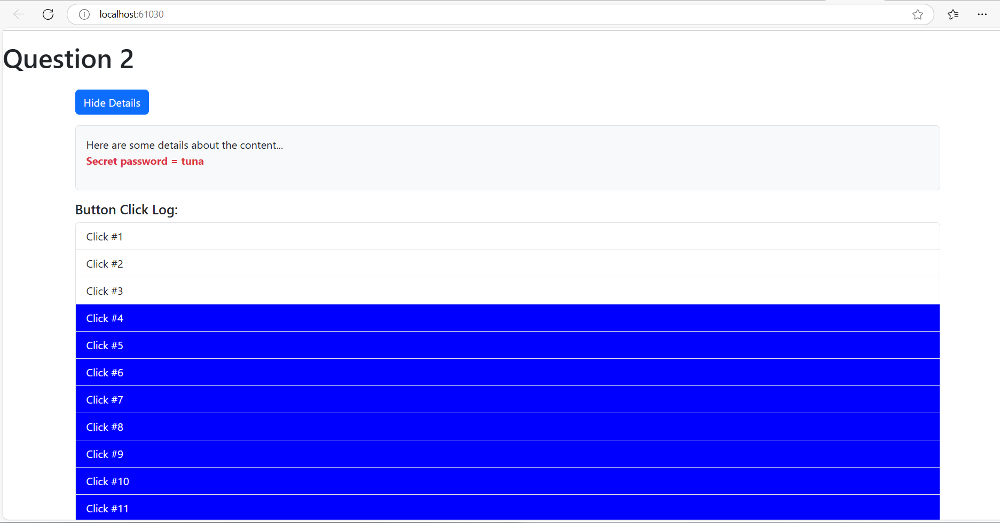

1. Add a button which says 'Display Details'
2. Add a paragraph with any content of your choice (E.g. 'secret password = tuna)
3. Toggle the displayimg of that paragraph with the button created in the first step
4. Log all button clicks in an array and output that array below the secret paragraph (maybe log a timestamp or simply an incrementing number)
5. Starting at the 5th log item, give all future log items a blue background (via ngSytyle) and white color (ngClass)

